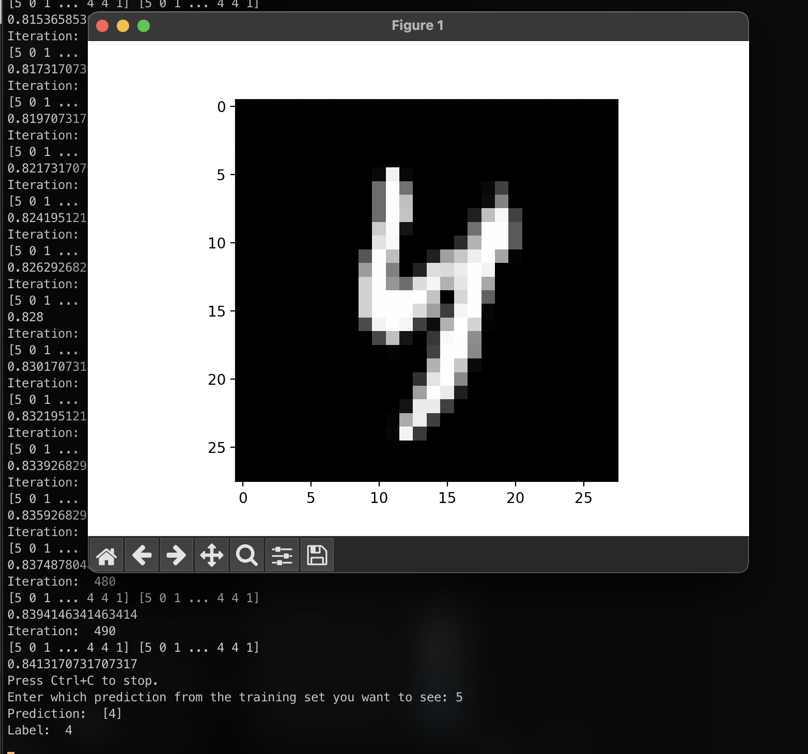

# Digit Predictor

This project is a neural network made using just math. With only the numpy library and 
pandas this neural net predicts handwritten digits at 84% accuracy.

## Run locally

Made using Python 3.11.5

After cloning the project

1. `pip install -r requirements.txt`
2. Run `python run.py` 

Image of how this program works

